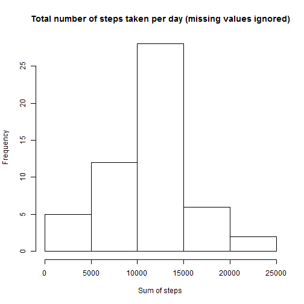
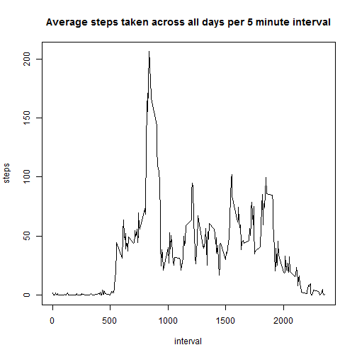
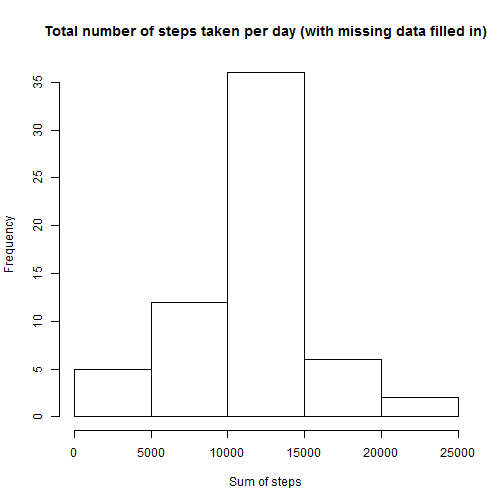
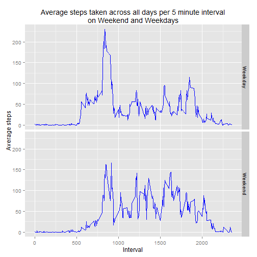

### Loading and preprocessing the data


```r
# Download data if not exist in current working directory.
inputfile="activity.csv"
zipfile="./repdata-data-activity.zip"
if (!file.exists(inputfile)) {
    if (!file.exists(zipfile)) {
        url="https://d396qusza40orc.cloudfront.net/repdata%2Fdata%2Factivity.zip"
        download.file(url, destfile=zipfile, method="curl")
        }
    unzip(zipfile)
    }

df <- read.csv(inputfile)
```

### Part1: What is mean total number of steps taken per day?

For this part of the assignment, the missing values in the dataset is ignored.

1. Make a histogram of the total number of steps taken each day.
    
    ```r
    stepsPD <- aggregate(steps ~ date, df, sum)
    hist(stepsPD$steps,
         main="Total number of steps taken per day (missing values ignored)",
         xlab="Sum of steps")
    ```
    
     

2. Calculate and report the **mean** and **median** total number of steps taken per day.
    
    ```r
    options(scipen=10)
    meanSteps <- mean(stepsPD$steps)
    medianSteps <- median(stepsPD$steps)
    ```
    - The calculated **mean** total number of steps taken per day is **10766.1886792**.  
    - The calculated **median** total number of steps taken per day is **10765**.

### Part2: What is the average daily activity pattern?

1. Make a time series plot (i.e. `type = "l"`) of the 5-minute interval (x-axis) and the average number of steps taken, averaged across all days (y-axis).

    
    ```r
    aveStepsPI <- aggregate(steps ~ interval, df, mean)
    with(aveStepsPI, plot(interval,
                          steps,
                          main="Average steps taken across all days per 5 minute interval",
                          type="l"))
    ```
    
     

2. Which 5-minute interval, on average across all the days in the dataset, contains the maximum number of steps?
    
    ```r
    maxAveStepsPI <- subset(aveStepsPI, steps==max(aveStepsPI$steps))$interval
    ```
    - **Interval 835** contains the **maximum** number of steps average across all the days per interval. 

### Part3: Imputing missing values

Note that there are a number of days/intervals where there are missing values (coded as NA). The presence of missing days may introduce bias into some calculations or summaries of the data.

1. Calculate and report the total number of missing values in the dataset (i.e. the total number of rows with NAs)

    
    ```r
    ttlNA <- sum(is.na(df$steps))
    ```
    - Number of rows in dataset with NA is **2304**.


2. Devise a strategy for filling in all of the missing values in the dataset. The strategy does not need to be sophisticated. For example, you could use the mean/median for that day, or the mean for that 5-minute interval, etc.
    - The strategy to be used for filling in all of the missing values in the dataset is by using the mean for each 5-minute interval.


3. Create a new dataset that is equal to the original dataset but with the missing data filled in.
    
    ```r
    df_NoNA <- df
    for (i in df_NoNA$interval) {
        ave <- aveStepsPI[aveStepsPI$interval == i, "steps"]
        df_NoNA[df_NoNA$interval==i & is.na(df_NoNA$steps), "steps"] <- ave
    }
    ```

4. Make a histogram of the total number of steps taken each day and Calculate and report the **mean** and **median** total number of steps taken per day. Do these values differ from the estimates from the first part of the assignment? What is the impact of imputing missing data on the estimates of the total daily number of steps?
    
    ```r
    stepsPD_NoNA <- aggregate(steps ~ date, df_NoNA, sum)
    hist(stepsPD_NoNA$steps,
         main="Total number of steps taken per day (with missing data filled in)",
         xlab="Sum of steps")
    ```
    
     
    
    
    ```r
    meanSteps_NoNA <- mean(stepsPD_NoNA$steps)
    medianSteps_NoNA <- median(stepsPD_NoNA$steps)
    ```
    - The calculated **mean** total number of steps taken per day after missing data filled in is **10766.1886792**.  
    - The calculated **median** total number of steps taken per day after missing data filled in is **10766.1886792**.   
    - The histogram of the total number of steps taken each day in is almost similar to the histogram in part1 except the frequency for sum of steps between 10000 to 15000, which have increased considerably. 
    - The mean and median after missing data filled in is almost the same as the mean and median in part1.

### Part4: Are there differences in activity patterns between weekdays and weekends?

Dataset with the filled-in missing values is being used for this part.

1. Create a new factor variable in the dataset with two levels -- "weekday" and "weekend" indicating whether a given date is a weekday or weekend day.
    
    ```r
    df_NoNA$wkPortion <- as.factor(unname(
        sapply(
            weekdays(as.Date(df_NoNA$date)),
            function(wkday) {
                if(wkday == "Saturday" | wkday == "Sunday") "Weekend"
                else "Weekday"
            }
        )
    ))
    ```

2. Make a panel plot containing a time series plot (i.e. `type = "l"`) of the 5-minute interval (x-axis) and the average number of steps taken, averaged across all weekday days or weekend days (y-axis). 
    
    ```r
    require(ggplot2)
    aveStepsPIW_NoNA <- aggregate(steps ~ interval + wkPortion, df_NoNA, mean)
    
    p <- ggplot(aveStepsPIW_NoNA, aes(interval, steps)) +
      ggtitle("Average steps taken across all days per 5 minute interval\non Weekend and Weekdays") +
      labs(x="Interval", y="Average steps") +
      geom_line(colour="blue") +
      facet_grid(wkPortion ~ .)
    
    print(p)
    ```
    
     
